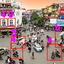
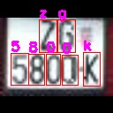
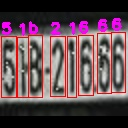

# Character-Time-series-Matching-For-Robust-License-Plate-Recognition
[](https://paperswithcode.com/sota/license-plate-recognition-on-ufpr-alpr?p=character-time-series-matching-for-robust-1)
## Setup
```python
pip install -r requirement.txt
```
## UFPR-ALPR:

Download 60 cropped tracks using YoloV5m: [test](https://drive.google.com/file/d/1U429KxS6SvoOMGoAGw0yQaDlLmBrLFgE/view?usp=sharing)
```python
python3 evaluate.py
```

### Results

<div align=center>

</div>
<div align=center>

</div>

## Vietnamese:

### Object detection

```python
cd Vietnamese/
python DETECTION.py --weights object.pt --imgsz 1280
```
<div align=center>

</div>

### Character Recognition

```python
cd Vietnamese/
python DETECTION.py --weights char.pt --imgsz 128
```
<div align=center>

  
</div>

## Citation

```
@INPROCEEDINGS{9924897,
  author={Quang, Huy Che and Thanh, Tung Do and Van, Cuong Truong},
  booktitle={2022 International Conference on Multimedia Analysis and Pattern Recognition (MAPR)}, 
  title={Character Time-series Matching For Robust License Plate Recognition}, 
  year={2022},
  volume={},
  number={},
  pages={1-6},
  doi={10.1109/MAPR56351.2022.9924897}
 }
```

## Acknowledgement
Our source code is inspired by:
- [YoloV5](https://github.com/ultralytics/yolov5)


