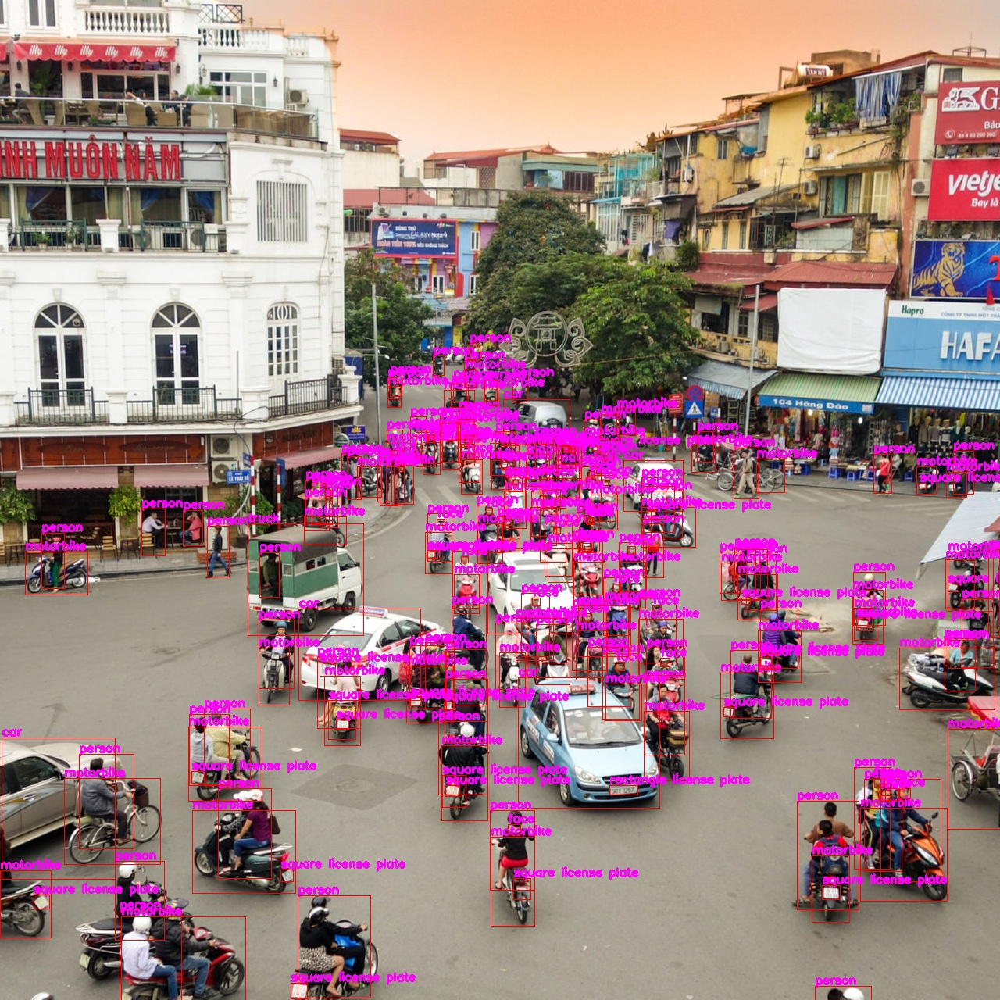

# Character-Time-series-Matching-For-Robust-License-Plate-Recognition
## Setup
```python
pip install -r requirement.txt
```
## UFPR-ALPR:

Download 60 cropped tracks using YoloV5m: [test](https://drive.google.com/file/d/1k1AtPXq7nVQDYBUW3luVei2S0jzvXfKx/view?usp=share_link)
```python
python3 evaluate.py
```

### Results

<div align=center>

</div>
<div align=center>

</div>

## Vietnamese:

### Object detection

```python
cd Vietnamese/
python DETECTION.py --weights object.pt --imgsz 1280
```
<div align=center>

</div>

### Character Recognition

```python
cd Vietnamese/
python DETECTION.py --weights char.pt --imgsz 128
```
<div align=center>

  
</div>

## Acknowledgement
Our source code is inspired by:
- [YoloV5](https://github.com/ultralytics/yolov5)


