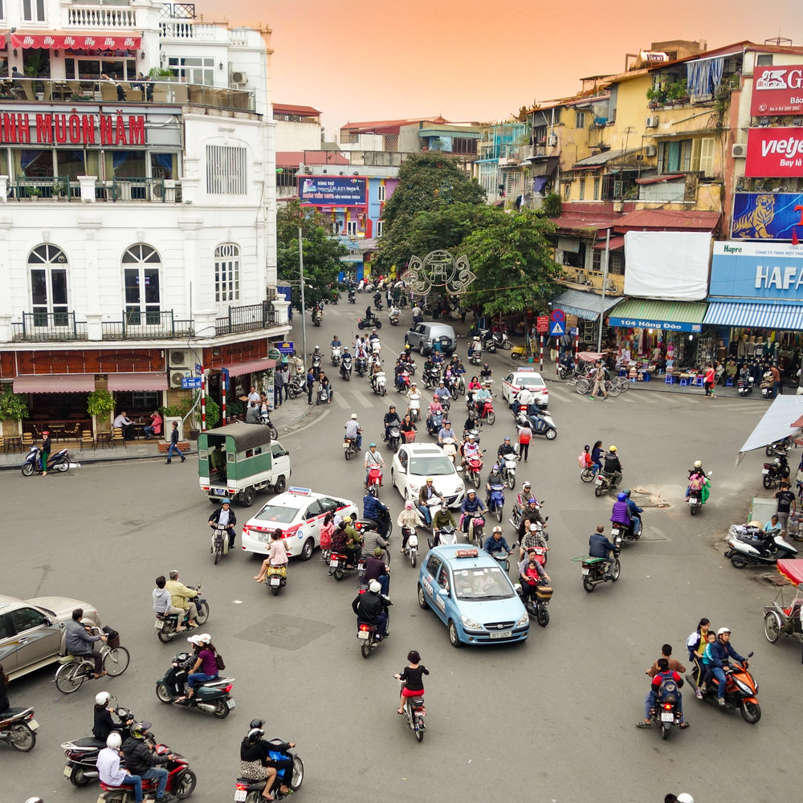

# Character-Time-series-Matching-For-Robust-License-Plate-Recognition

## UFPR-ALPR:

Download 60 cropped tracks using YoloV5m: [test]
```python
python3 evaluate.py
```
## Vietnamese:

### Object detection

```python
cd Vietnamese/
python3 DETECTION.py
```
<div align=center>

</div>

### Character Recognition
```python
cd Vietnamese/
python DETECTION.py --weights object.pt --imgsz 1280
```
<div align=center>

</div>

cd Vietnamese/
python DETECTION.py --weights char.pt --imgsz 128
```
<div align=center>

</div>

